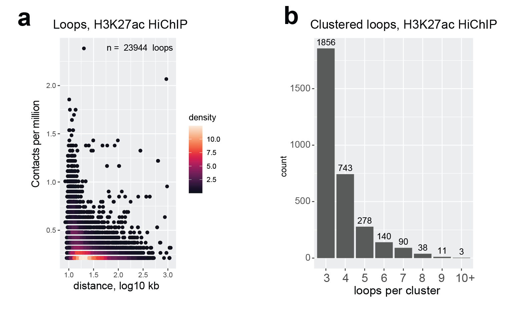
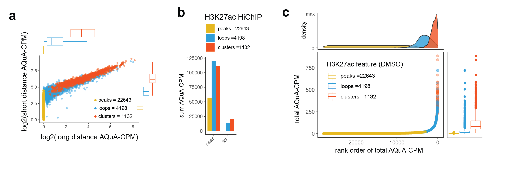

# peaks3d
HiChIP Analysis Tools

## Pipeline Overview:
Input: 

       (1) Peak locations (BED file), typically from MACS

       (2) HiChIP or AQuA-HiChIP data (.hic file format)
       
       (3) Configuration file indicating BED file(s), HiChIP sample(s), and loop/cluster parameters
       
Software components and steps within peaks3D:
<a href="https://github.com/GryderLab/peaks3d/blob/main/examples/peaks3D_GRACE_overview.png"> 

 

## Example peaks3D and GRACE output:
Summary data figure:

 

Genic Rank of Clustered Elements plots:

 

## dependency 
- https://github.com/axiotl/aqua-tools
