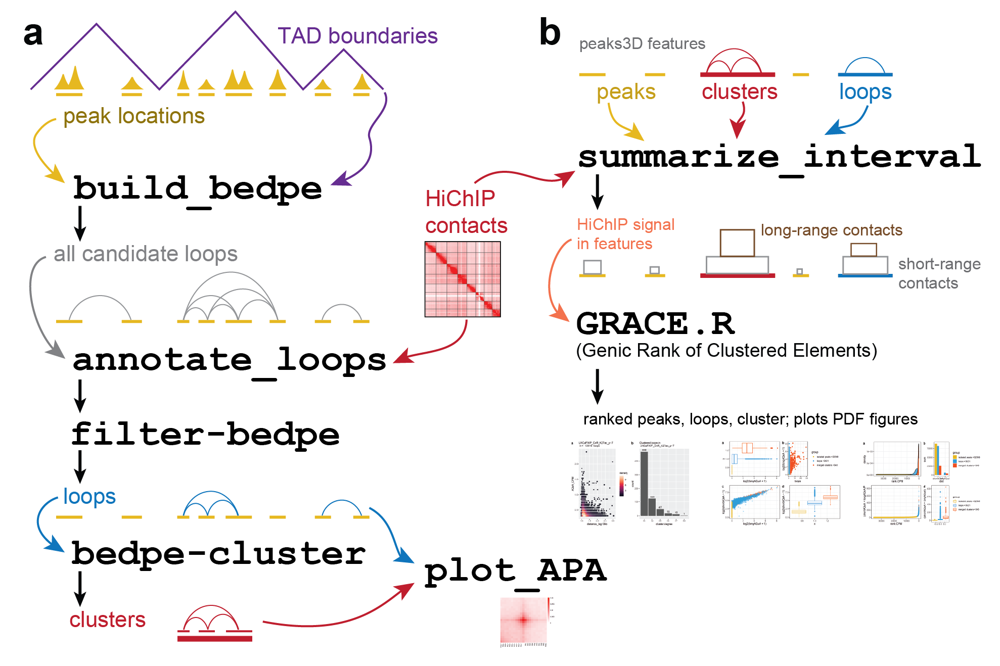

# peaks3d
HiChIP Analysis Tools

## Pipeline Overview:
Input: (1) Peak locations (BED file), typically from MACS
       (2) HiChIP or AQuA-HiChIP data (.hic file format)
       (3) Configuration file indicating BED file(s), HiChIP sample(s), and loop/cluster parameters
<a href="https://github.com/GryderLab/peaks3d/blob/main/examples/peaks3D_GRACE_overview.png"> 

 

## Example peaks3D and GRACE output:

## dependency : 
- https://github.com/axiotl/aqua-tools
