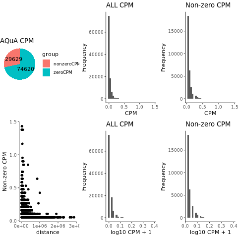

## Introduction 
This pipeline uses Aqua_tools and baby-tinker tools to 
(1) create BEDPE from self-associate of peaks in a BED file 
(2) annotate_loops to count HiChIP contacts and plot QC 
(3) filter for significance based on HiChIP contacts between connected peaks
(4) generate clustered peaks based on HiChIP 3D contacts and APA plots
Simple clustering algorithm ([bedpe-cluster](https://github.com/GryderLab/baby-tinker/blob/main/inst/bin/src_bedpe.sh)):
```
=> count clusters
[  ]-----------------[   ]                         (loop1)
                     [   ]-----------------[   ]   (loop2)
             [   ]-------------------------[   ]   (loop3)
        [   ]----------------------[     ]         (loop4)

=> find clusters 
                     [ 2 ]                 [ 2 ]   (cluster call by threshold >= 2 loops)

=> seperate loops
[  ]-----------------[   ]                         (clustered)
                     [   ]-----------------[   ]   (clustered)
           [   ]---------------------------[   ]   (clustered)
	   
        [   ]----------------------[     ]         (notclustered)

```
Issue: the loop 3 and 4 are next to each other. merging adjacent peaks would improve the power of detection.
### Updates
- mincluster parameter is added
- add counts in the piechart of the qc plots
- add short and long distance qc plots  ( *.qc_gt_<mindist>.png and *.qc_lt_<mindist>.png )
 
### Step 1: Prepare input data and parameters 
Modify the peaks3d_config.txt  file. The peaks are MAC2 called peaks. The samples are used to look for HiChIP hic files in the tinker lab-data/hg38 directories.
You can change function parameters to change bin size, cutoff, and contact distance to find good 3D loops and draw APA plots.
 
```
## input files 
tad=/home/ubuntu/shared/hg38/ref/TAD_goldstandard.hg38.bed 
peaks=(
	peaks/LNCaPXIP_AR_122121_SEK_NovoG_MACS_p-5.nobl.bed
	peaks/LNCaPXIP_BG15n_H3K27ac_122121_SEK_NovoG_MACS_p-5.nobl.bed
	peaks/LNCaPXIP_CTCF_122121_SEK_NovoG_MACS_p-14.nobl.bed
	peaks/LNCaPXIP_DMSO_H3K27ac_122121_SEK_NovoG_MACS_p-7.nobl.bed
)
samples=(
	LNCaPXIP_AR
	LNCaPXIP_BG15n_H3K27ac
	LNCaPXIP_CTCF
	LNCaPXIP_DMSO_H3K27ac
)

## function parameters
binsize=10000  # binsize for annotated_loops.sh 
mindist=10k    # min distance 
maxdist=3m     # max distance to make fitered.bedpe files
minscore=0.2 # minimum annotated.bedpe score
APAbinsize=5000 ## APA bin size
mincluster=2 # cluster threshold (default 2 filtered contacts)  

## output directory
output=output1

```
### Step 2: run peaks3d pipeline 
Use the above input.sh file to run [run-peaks3d.sh](../inst/bin/run-peaks3d.sh) tool.
```
run-peaks3d.sh peaks3d_config.txt
```
This will generate the clustered and not-clustered 3d contacts
and other useful intermediate files on the output directory:
| output file             |  content |
|-------------------------|-------------------------|
| *.bedpe | candidate 3d contacts generated from ChIP-seq peaks |
| *.annotated.bedpe | 3d contact counts |
| *.annotated.bedpe.qc.pdf[png] | QC plots of distance and annotated score |
| *.filtered.bedpe | filtered 3d contact by the parameter threholds in the input.sh |
| *.cluster.bedGraph | 2D density of peak contacts |
| *.clustered.bedpe | clustered 3d contacts that either of ends intersect with the 2d cluster region |
| *.notclustered.bepe | not clustered 3d contacts |
| */clustered/*/APA_aqua.pdf | APA plots of 3d contacts in cluster |
| */notclustered/*/APA_aqua.pdf | APA plots of 3d contact not in cluster |

Results (number of entries)
```
## filtered 3D contacts
   2864 LNCaPXIP_AR_122121_SEK_NovoG_MACS_p-5.nobl.filtered.bedpe
   1060 LNCaPXIP_BG15n_H3K27ac_122121_SEK_NovoG_MACS_p-5.nobl.filtered.bedpe
  58412 LNCaPXIP_CTCF_122121_SEK_NovoG_MACS_p-14.nobl.filtered.bedpe
   4318 LNCaPXIP_DMSO_H3K27ac_122121_SEK_NovoG_MACS_p-7.nobl.filtered.bedpe


## cluster regions
   517 LNCaPXIP_AR_122121_SEK_NovoG_MACS_p-5.nobl.cluster.bedGraph
   113 LNCaPXIP_BG15n_H3K27ac_122121_SEK_NovoG_MACS_p-5.nobl.cluster.bedGraph
 14438 LNCaPXIP_CTCF_122121_SEK_NovoG_MACS_p-14.nobl.cluster.bedGraph
   903 LNCaPXIP_DMSO_H3K27ac_122121_SEK_NovoG_MACS_p-7.nobl.cluster.bedGraph

## in-cluster 3D contacts (enither ends sharing with the cluster)
   1724 LNCaPXIP_AR_122121_SEK_NovoG_MACS_p-5.nobl.clustered.bedpe
    402 LNCaPXIP_BG15n_H3K27ac_122121_SEK_NovoG_MACS_p-5.nobl.clustered.bedpe
  57402 LNCaPXIP_CTCF_122121_SEK_NovoG_MACS_p-14.nobl.clustered.bedpe
   2900 LNCaPXIP_DMSO_H3K27ac_122121_SEK_NovoG_MACS_p-7.nobl.clustered.bedpe

```


### Step 3: visualization and interpretation
#### QC distance and score to iteratively tune the parameters
The summary of the distance and score distributions give us an idea of how to select the threshold. 
Based on this observation we set the CPM threshold >= 0.2.
|   LNCaPXIP_BG15n_H3K27ac_122121_SEK_NovoG_MACS_p-7.nobl.annotated.bedpe |
|:-------------------------:|
|  |

Selection of the CPM thresholds can be automatized by desining our own metcis or adopting existing tools such as [FitHiChIP](https://www.nature.com/articles/s41467-019-11950-y)

#### IGV browsing
Upload the 
*.cluster.bedGraph
*.filtered.bedpe ( *.clustered.bedpe *.notclustered.bedpe )
files on the IGV to run visual analysis. 
The cluster levels indicate the number of 3D contacts (filtered >=0.2 CPM).
The first three tracks are AR cluster, filtered.bedpe, clustered.bepe, and not clustered.bedpe tracks.
The next three tracks are those of DMSO H3K27ac.
The last two are CTCF cluster and filtered.bedpe tracks.
range: chr1:7,678,646-9,038,042

These clustered and not clustered bedpe files are used to draw the below APA plots 


#### APA plots
Compare the 3D distributions using the clustered and not clustered APA plots. 
Look at the APA plots to see the difference of 3D structures between clustered and not clustered contacts.

| clustered | not clustered |
|-------------------------|:-------------------------:|
|  |   | 

